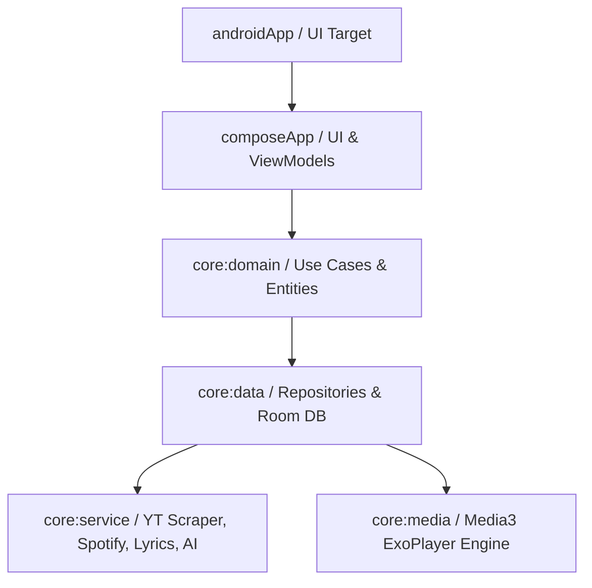

<div align="center">

```
  ____       _              ____  _                       
 |  _ \ __ _| |_ __ ___    |  _ \| | __ _ _   _  ___ _ __ 
 | |_) / _` | | '_ ` _ \   | |_) | |/ _` | | | |/ _ \ '__|
 |  __/ (_| | | | | | | |  |  __/| | (_| | |_| |  __/ |   
 |_|   \__,_|_|_| |_| |_|  |_|   |_|\__,_|\__, |\___|_|   
                                          |___/           
```

### 🌴 **Modern • Ad-Free • Lossless • Cross-Platform Music Client** 🌴

[](https://kotlinlang.org)
[](https://android.com)
[](https://www.jetbrains.com/lp/compose-multiplatform/)
[](LICENSE)
[](#)

<p align="center">
  <b>Palm Player</b> is a lightweight, ad-free music streaming app engineered with <b>Kotlin & Compose Multiplatform</b>.<br/>
  Powered by YouTube Music backend, Spotify Canvas integration, real-time synced lyrics, and an audiophile-grade 10-band equalizer.
</p>

---

</div>

## ✨ Highlights & Features

<table>
  <tr>
    <td width="50%">
      <h3>🎧 Pure Listening Experience</h3>
      <ul>
        <li><b>Zero Advertisements:</b> Seamless uninterrupted audio.</li>
        <li><b>High-Fidelity Audio:</b> Up to 256kbps stream with Opus codec.</li>
        <li><b>Background Playback:</b> Listen with screen off or while multitasking.</li>
        <li><b>Offline Mode:</b> Intelligent audio & thumbnail caching for offline playback.</li>
      </ul>
    </td>
    <td width="50%">
      <h3>📜 Synced Lyrics & Canvas</h3>
      <ul>
        <li><b>Multi-Source Lyrics:</b> YouTube captions, LRCLIB, BetterLyrics, and Spotify.</li>
        <li><b>Word & Line Sync:</b> Smooth real-time karaoke scrolling.</li>
        <li><b>AI Lyrics Translation:</b> Translate foreign tracks on-the-fly.</li>
        <li><b>Spotify Canvas:</b> Dynamic looping visual canvases.</li>
      </ul>
    </td>
  </tr>
  <tr>
    <td width="50%">
      <h3>🎛️ Audiophile Sound Controls</h3>
      <ul>
        <li><b>10-Band Parametric Equalizer:</b> Custom curve tuning with preamp control.</li>
        <li><b>AutoEq Integration:</b> Instant headphone profile imports.</li>
        <li><b>Crossfade DJ Engine:</b> Gapless transition between songs like Apple Music.</li>
        <li><b>Volume Normalization:</b> Consistent loudness across distinct tracks.</li>
      </ul>
    </td>
    <td width="50%">
      <h3>🚗 Ecosystem & Integration</h3>
      <ul>
        <li><b>Android Auto:</b> Full native automotive dashboard with media browser.</li>
        <li><b>Google Cast:</b> Cast playback to smart TVs and speakers.</li>
        <li><b>Last.fm Scrobbler:</b> Live scrobbling & now-playing updates.</li>
        <li><b>Discord Rich Presence:</b> Broadcast your listening status.</li>
      </ul>
    </td>
  </tr>
</table>

---

## 🎨 Modern UI & Customization

- **Material You Dynamic Theming:** Adapts color palette to album artwork or your system wallpaper.
- **Glassmorphic & AMOLED Modes:** Crisp contrast, translucent bottom bar, and fluid gesture navigation.
- **Queue & Playlist Management:** Drag-and-drop playlist sorting and instant synchronization.

---

## 🏗️ Architecture

Palm Player is built following **Clean Architecture** and reactive unidirectional data flow:



- **UI Framework:** Jetpack Compose Multiplatform
- **DI:** Koin BOM
- **Networking & Serialization:** Ktor Client + Kotlinx.serialization
- **Audio Engine:** AndroidX Media3 (ExoPlayer) + Custom Audio Processors
- **Local Persistence:** Room Database + AndroidX DataStore

---

## 🚀 Building from Source

### Prerequisites
- **JDK 17 or JDK 21** installed and configured (`JAVA_HOME`).
- **Android SDK Platform 37** (or latest) with Build Tools installed.

### Quick Build

1. **Clone the repository:**
   ```bash
   git clone https://github.com/switchb1ade/EchoEcho.git
   cd EchoEcho
   ```

2. **Configure SDK Location:**
   Create or edit `local.properties`:
   ```properties
   sdk.dir=/path/to/your/Android/Sdk
   ```

3. **Build Debug APK:**
   ```bash
   # On Windows (PowerShell)
   .\gradlew.bat assembleDebug

   # On Linux / macOS
   ./gradlew assembleDebug
   ```

4. **Locate Generated APKs:**
   Built APKs are located at:
   ```
   androidApp/build/outputs/apk/debug/
   ```

---

## 📄 License

This project is open source and distributed under the **GNU General Public License v3.0 (GPL-3.0)**. See the [LICENSE](LICENSE) file for more information.

<div align="center">
  <sub>Built with 🌴 for music lovers everywhere.</sub>
</div>
